# Brief introduction
* **Statement of purpose**
    * In bifurcating reaction, we need two independent IRC jobs as the inputs. One IRC has its own coordinate, and two IRC have two individual coordinates. In order to build 2D-PES, we need one and only one coordinate frame for all molecules. 
    * In order to map trajectories on 2D-PES, their coordinate frames should be the same. While, most of the time, trajectories has their own coordinates and the structures on this surface also have their own coordinates. 
  
* **Object**
    * Rotate two molecules to the same frame in the most efficient way, which means superimpose two molecular structure as much as possible. 

* **Programs**
    * `rot.f90`: test subroutine do_rotation().
    * `OverlapStruc.f90`: rotate var. struc. to ref. struc.
    * `manyRot.sh`: rotate a serious of struc.

* **Flowchart of the main program**
    1. I/O part: extract the number of atoms to allocate memory
    2. Translation: move two structures to the center of mass
    3.
    1. Print out the adjustable coordinate to file, move.$1.

* **Key subroutine: do_rotation()**
    1. 
---
# Logbook for debugging
* **2018/10/05**
  * Problem:
    * 2-atom systems are all work, but fail for 4-atom system.
    * Some systems are too symmetric, may generate degenerate moment of inertia. 
  * Strategy:
    * Test H2O molecule, and use rotational matrix to generate several variable structures.
    * Use `OverlapStruc.f90` to rotate those variable structures back to the reference structure.  
* **2018/12/13**
  * Problem: 
    * After compare the selected moment of inertia before and after rotation, they are not the same. I over-simplified the issue before that the rotation matrix cannot be simply constructed by overlap the moment of inertia. 
  * Strategy:
    * Using the elegant mathematical tool: quaternion.

---
# Detail of process
## Strategy
1. Use `Gaussian 09` to optimize H2O structure
   * Output: *H2O.log*
2. Get the coordinate of *H2O.log* as *ref.xyz*.
3. Use `rot.f90` to rotate *ref.xyz*, and also move molecule to its center of mass. 
4. Test both standard axis and random axis, and also use random angle.
    1. Standard axis
        1. $n_x$ = (1,0,0) -> x-axis
        2. $n_y$ = (0,1,0) -> y-axis
        3. $n_z$ = (0,0,1) -> z-axis
    2. Random axis
    3. Generate several variable structures.
    * Output: *var$n.xyz*,  $n=1,2,3...
5. Use program `OverlapStruc.f90` to rotate *var$n.xyz* back to *ref.xyz*.
## Selection of visualizer: Jmol
<!-- HTML table -->
<table>
  <tbody>
    <tr>
      <th align="center">Comparison</th>
      <th align="center">Jmol</th>
      <th align="center">IQmol</th>
    </tr>
    <tr>
      <td align="center">Pros.</td>
      <td align="left">
        <ul>
          <li>open it via terminal</li>
          <li>less resource is used</li>
        </ul>
      </td>
      <td align="left">
        <ul>
          <li>overlap two structures</li>
          <li>easier to do translation and rotation</li>
        </ul>
      </td>
    </tr>
    <tr>
      <td align="center">Cons.</td>
      <td align="left">default setting is ugly</td>
      <td align="left">default origin of coordinate is WRONG! </td>
    </tr>
    <tr>
        <td align="center"> 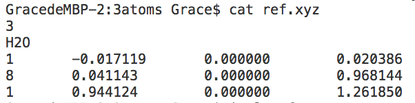</img></td>
        <td>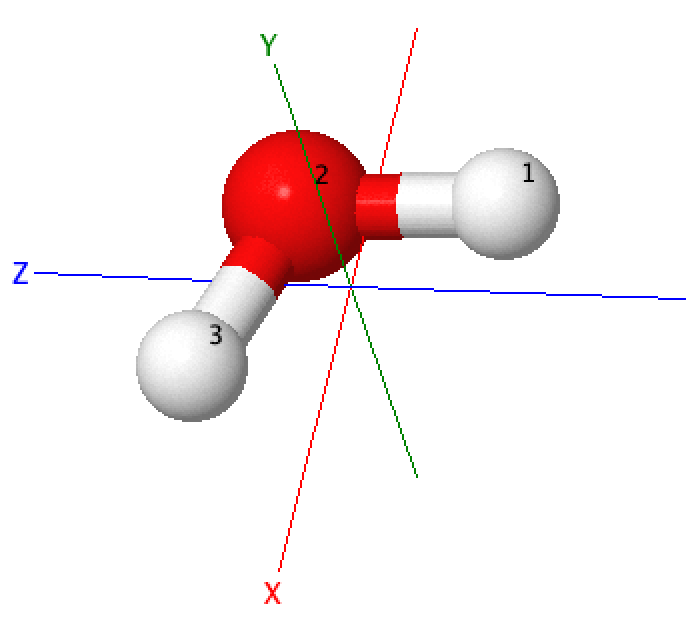</img></td>
        <td>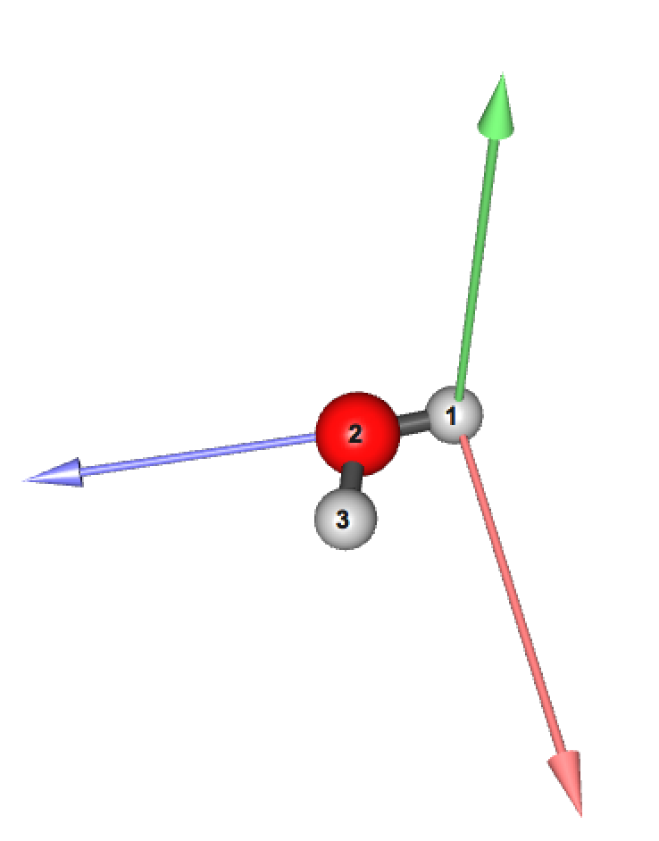</img></td>
    </tr>
  </tbody>
</table>

The default setting of IQmol need to be modified that the origin of coordinate is wrong! Based on the above plotting, it moves the number 1 hydrogen as the origin, but the coordinate of this hydrogen is (-0.0171,0,0.02038). 

## **3-atom objects ; H$_2$O molecule**
### **Preparation step**
1. After optimized water molecule from gaussian, I extracted the coordinate as *ref.xyz*. And then, I moved the reference structure to its center of mass; *trans.ref.xyz*.
   * Program: `Gaussian09`
  <!-- <td>: normal text, <th>: bold, <tr>: next block
  https://developer.mozilla.org/en-US/docs/Web/HTML/Element/tbody
  -->
   <table>
    <tbody>
        <tr>
            <td align="center"> <i> ref.xyz </i> </td>
            <td align="center"> <i> trans.ref.xyz </i> </td>
        </tr>
        <tr>
            <td align="center"> </img></td>
            <td align="center">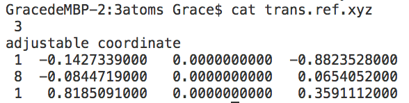</img></td>
        </tr>
    </tbody>
   </table>

2. Quick test of the rotation matrix from quaternion.
    * Program: `rot.f90`
    * Coordinate: right-hand rule
    * Rotation angle: counterclockwize for axis (fix object), but it is clockwize for object (fix axis).
   <table>
    <body>
        <tr>
            <td> Angle/Axis</td>
            <td align="center"> x</td>
            <td align="center"> y</td>
            <td align="center"> z</td>
        </tr>
        <tr>
            <td align="center"> 0 </td>
            <td>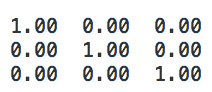</img></td>
            <td></img></td>
            <td></img></td>
        </tr>
        <tr>
            <td align="center">pi/2</td>
            <td></img></td>
            <td>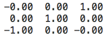</img></td>
            <td>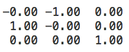</img></td>
        </tr>
        <tr>
            <td align="center">pi</td>
            <td>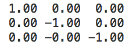</img></td>
            <td>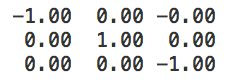</td>
            <td>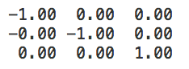</td>
        </tr>
    </body>
   </table>

    * Reference
        * [Quaternion-derived rotation matrix](https://en.wikipedia.org/wiki/Quaternions_and_spatial_rotation)
        * [Rotation matrix](https://en.wikipedia.org/wiki/Rotation_matrix)

3. Generate 3 variable structures by rotating the *trans.ref.xyz*.
   * Program: `rot.f90`
<table>
  <tbody>
    <tr>
      <td>Label</td>
      <td align="center"> <i> trans.ref </i> </td>
      <td align="left"> <i> var1 </i> </td>
      <td align="left"> <i> var2 </i> </td>
      <td align="left"> <i> var3 </i> </td>
    </tr>
    <tr>
      <td>Operation</td>
      <td align="left">no operation</th>
      <td align="left">rotate via x-axis (red)</th>
      <td align="left">rotate via y-axis (green)</th>
      <td align="left">rotate via z-axis (blue)</th> 
    </tr>
    <tr>
      <td>Rotation axis</td>
      <td align="left"> NA </th>
      <td align="left">(1,0,0)</th>
      <td align="left">(0,1,0)</th>
      <td align="left">(0,0,1)</th> 
    </tr>
    <tr>
      <td>Rotation angle (radian) </td>
      <td align="left">NA</th>
      <td align="left"> 4*pi/7</th>
      <td align="left"> 4*pi/7</th>
      <td align="left"> 4*pi/7</th> 
    </tr>
    <tr>
      <td>Rotation matrix</td>
      <td align="left">NA</th>
      <td align="left">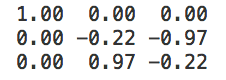</img></th>
      <td align="right">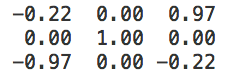</img></th>
      <td align="right">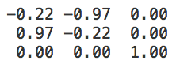</img></th> 
    </tr>
    <tr>
      <td>Explicit coordinate</td>
      <td align="left"></img></th>
      <td align="right">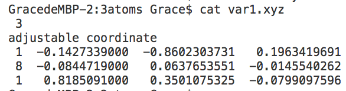</img></th>
      <td align="right">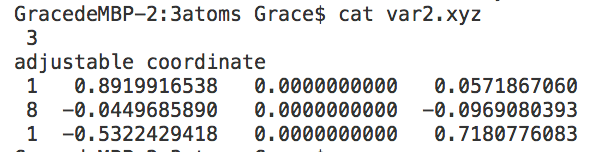</img></th>
      <td align="right">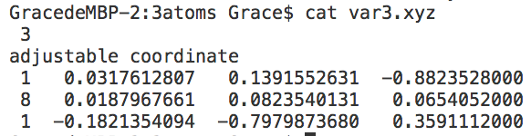</img></th> 
    </tr>
    <tr>
      <td>Before rotation with different angle of view</td>
      <td align="left">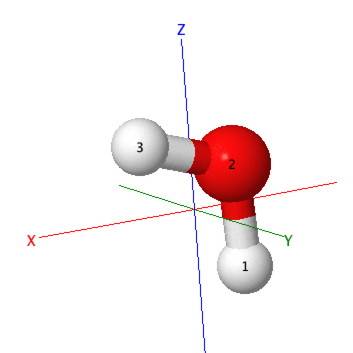</img></td>
      <td align="right">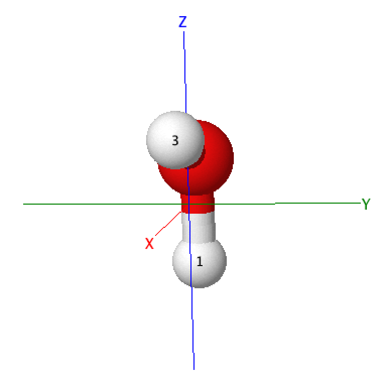</img></td>
      <td align="right">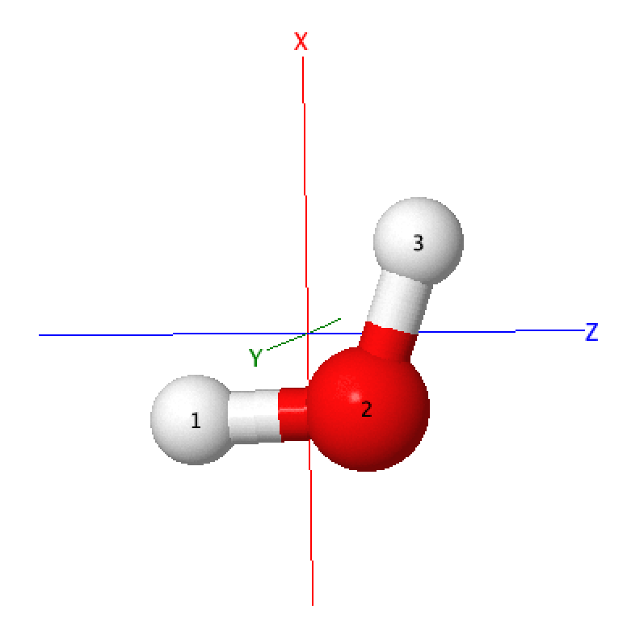</img></td>
      <td align="right">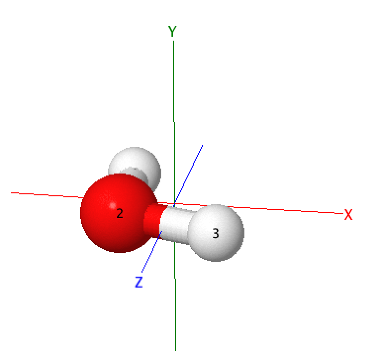</img></td> 
    </tr>
    <tr>
      <td>After rotation</td>
      <td align="left"></img></td>
      <td align="right">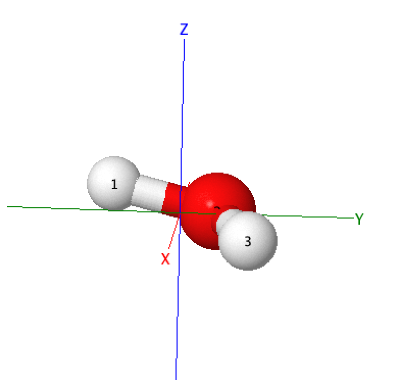</img></td>
      <td align="right">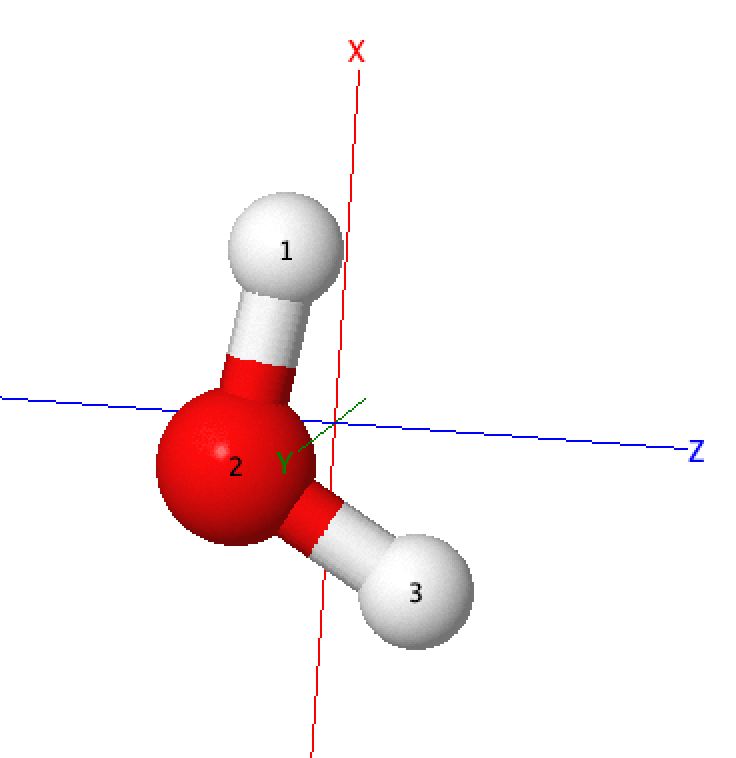</img></td>
      <td align="right">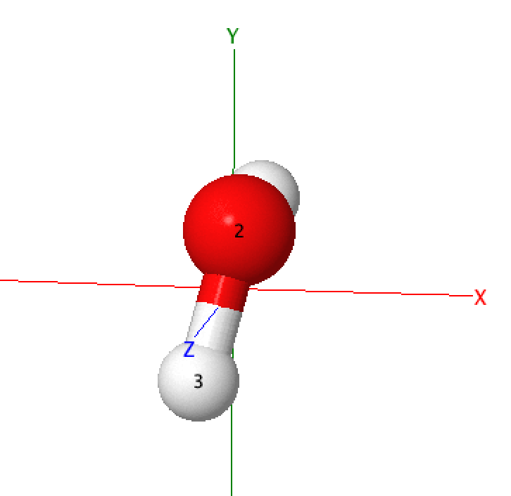</img></td> 
    </tr>
  </tbody>
</table>

#### Step-by-step run program `OverlapStruc.f90`  

1. How to rotate a molecule?
   * **Generate rotation axis**
     * After calculate their moment of inertia, calculate the cross product as the rotation axis.
     * Yellow arrow: moment of inertia
     * Black arrow: rotation axis (in figure *var1*)
    <table>
    <tbody>
        <tr>
            <td>Label</td> 
            <td align="center" > <i> trans.ref </i> </td>
            <td align="center" > <i> var1 </i> </td>
        </tr>
        <tr>
            <td>Orientation</td> 
            <td>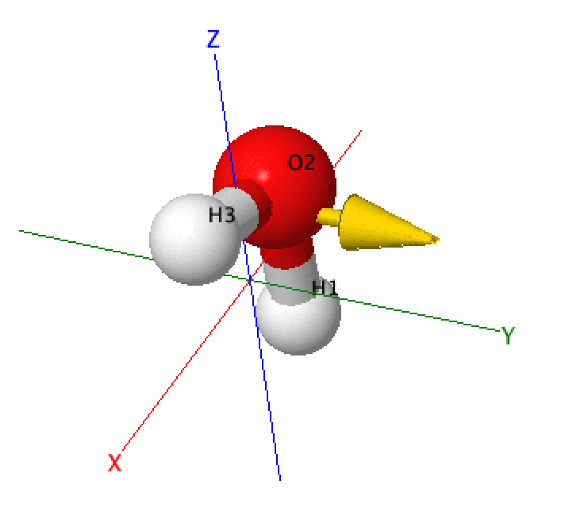</img></td>
            <td></img></td>
        </tr>
    </tbody>
    </table> 

    * **Select rotation angle**
    <table>
    <tbody>
        <tr>
            <td>Operation</td>
            <td align="center" >Source code</td>
            <td align="center" >Description</td>
        </tr>
        <tr>
            <td>Angle seeting</td> 
            <td>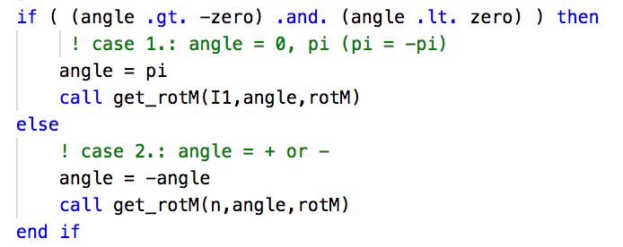</img></td>
            <td>Rotation axis has two directions which we cannot control, but we can calculate both positive and negative angles. And then generate two rotation matrix to rotate variable structure.</td> 
        </tr>
        <tr>
            <td>Filter via RMSD</td>
            <td>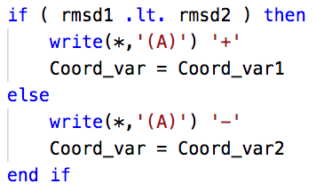</img></td>
            <td align="left"> After rotate variable structure in two directions, we can compare their RMSD to select the smaller one. </td>
        </tr>
    </tbody>
    </table> 

2. First rotation: overlap the largest moment of inertia
   <table>
    <tbody>
        <tr>
            <td></td> 
            <td align="center" > <i> trans.ref </i> </td>
            <td align="center" > <i> var1 </i> </td>
            <td align="center" > <i> var2 </i> </td>
            <td align="center" > <i> var3 </i> </td>
        </tr>
        <tr>
            <td>Orientation before rotation</td> 
            <td align="left"></img></td>
            <td align="right"></img></td>
            <td align="right"></img></td>
            <td align="right"></img></td>
        </tr>
        <tr>
            <td> Selected moment of inertia</td>
            <td> (0,0.2225,0.9749)</td>
            <td> (0,1,0)</td>
        </tr>
        <tr>
            <td>rotation axis</td>
            <td> NA </td>
            <td> (-1,0,0) </td>
        </tr>
        </tr>
        <tr>
            <td> rotation angle (RMSD)</td>
            <td> NA </td>
            <td> 1.35 (0.2454), -1.35 (1.1025)</td>
        </tr>
        <tr>
            <td> quaternion with smallest RMSD</td>
            <td> NA </td>
        </tr>
        <tr>
            <td> rotation matrix</td>
            <td> NA </td>
            <td align="left">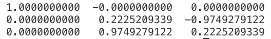</img></td>
        </tr>
        <tr>
            <td> Orientation after rotation</td>
            <td align="left"></img></td>
            <td align="right">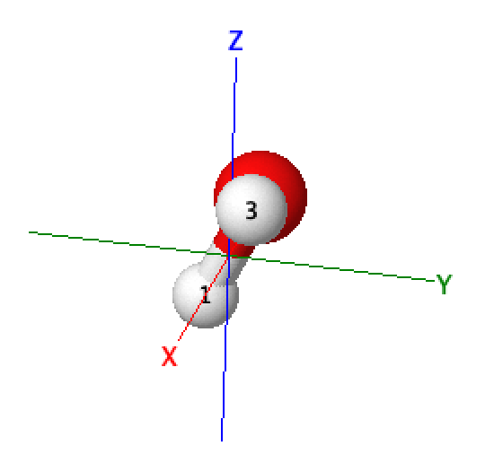</img></td>
            <td align="right"></img></td>
            <td align="right"></img></td>
        </tr>
        <tr>
            <td> Final RMSD</td>
        </tr>
    </tbody>
    </table>
    
    