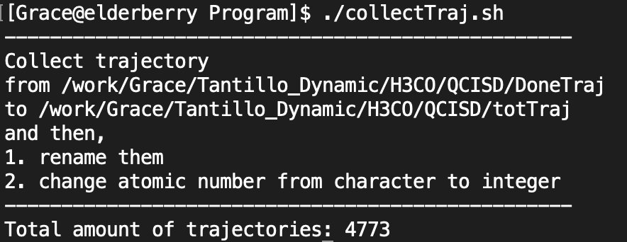

# **2D-PES of Reaction with PTSB**

## Table of Content
- [**2D-PES of Reaction with PTSB**](#2d-pes-of-reaction-with-ptsb)
  - [Table of Content](#table-of-content)
  - [- Acknowledgments](#acknowledgments)
- [**Introduction of PTSB**](#introduction-of-ptsb)
  - [What I know](#what-i-know)
  - [My strategies](#my-strategies)
  - [PTSB systems](#ptsb-systems)
- [**Getting Start**](#getting-start)
  - [1. Analytical 2D-PES practices](#1-analytical-2d-pes-practices)
  - [2. Numerical 2D-PES with the projection of quasi-classical dynamic trajectories](#2-numerical-2d-pes-with-the-projection-of-quasi-classical-dynamic-trajectories)
    - [Step 1: Calculate normal IRC paths](#step-1-calculate-normal-irc-paths)
    - [Step 2: Asymmetric cases: generate artificial reaction coordinate](#step-2-asymmetric-cases-generate-artificial-reaction-coordinate)
    - [Step 3: Construct x- and y-axes (optional)](#step-3-construct-x--and-y-axes-optional)
      - [*Symmetric cases*](#symmetric-cases)
      - [*Asymmetric cases*](#asymmetric-cases)
    - [Step 4: Select 1D grid points for all IRC paths](#step-4-select-1d-grid-points-for-all-irc-paths)
    - [Step 5: Scan a 2D-PES](#step-5-scan-a-2d-pes)
    - [Step 6: Project dynamic trajectories on this 2D-PES.](#step-6-project-dynamic-trajectories-on-this-2d-pes)
  - [Authors](#authors)
  - [Acknowledgments](#acknowledgments)
---
# **Introduction of PTSB** 
## What I know 
1. Some products' ratio cannot be explained by a single-step mechanism (cf. [Chemical Science, 2016, 00, 1-3][ref1])
2. Selectivity of chemical reaction is dominant by dynamic effect in post-transition-state bifurcation (PTSB). (cf.[ Nature Chemistry, 2014, 6, 104-111.][ref2])
3. Traditional IRC cannot describe PTSB.
4. Most PTSBs calculate AIMD trajectories to interpret dynamic effect.  
5. From organic chemists point of view, potential energy surface (PES) is a tool to give a reasonable chemical picture. 
6. Full PES is a NP problem. 

## My strategies
1. Select two important degrees-of-freedom in multi-dimensional space to build a 2D-PES.
   - Combine the normal coordinate and 'local mode picture'. 
      -  Analysis the reaction path from TSS1 to P1, and then construct the reaction coordinate from VRI region to TSS2.
        <!-- - FIXME: this part should be rewrite -->
   - Using the character of VRI for asymmetric case (cf. [International Journal of Quantum Chemistry 2015, 115, 258-269][ref3]). 
     - VRI: its zero eigenvalue is orthogonal to the gradient 
    
1. If 2D-PES cannot be built, then build the leading reaction pathways. 

[ref1]: http://pubs.rsc.org/en/Content/ArticleLanding/2017/SC/C6SC03745C#!divAbstract
[ref2]: https://www.nature.com/articles/nchem.1843

---

## PTSB systems
1. Symmetry cases: 
   1. CH3O isomerization ([International Journal of Quantum Chemistry 2015, 115, 258-269][ref3])
   2. C2H4 + HX, X=F,Cl and Br.
   
   <!-- PATH: /aux/TestSystem/symmetricPES/CH3O -->
2. Asymmetry cases: 
    1. CH2O + CH3Cl ([International Journal of Quantum Chemistry 2015, 115, 258-269][ref3])
    2. HCN ([Theoretical Chemistry Accounts 2004, 112, 40-51][ref4])
    

[ref3]: https://onlinelibrary.wiley.com/doi/abs/10.1002/qua.24757
[ref4]: https://link.springer.com/article/10.1007%2Fs00214-003-0558-8
[ref5]: https://pubs.acs.org/doi/abs/10.1021/jacs.7b01042

<!-- ## Systems have AIMD results #
1. Abietadiene?
   <div style='float: center'>
        </img>
    </div> 
2. Rh project (cf. [Chemical Science, 2016, 00, 1-3][ref1])
     <div style='float: center'>
        </img>
    </div> 
3. Ring opening (from Stephanie R.Hare)
   <div style='float: center'>
        </img>
    </div>  -->

---

# **Getting Start**

## 1. Analytical 2D-PES practices
- Goals
    1. Practice how IRC work
    2. Search the bifurcated pathways
- Search the bifurcated pathways
  - Running steepest decent path from different starting points (VRI point and the points nearby). If the gradient becomes zero, it will switch to the direction of the Hessian eigenvector with a negative eigenvalue.

   <div style='float: center'>
        </img>
    </div> 
- Searching the first order saddle point.
    <div style='float: center'>
        </img>
    </div> 

## 2. Numerical 2D-PES with the projection of quasi-classical dynamic trajectories

- **Overview all processes**
    1. Calculate normal IRC paths
    2. Asymmetric cases: generate artificial reaction coordinate
    3. Construct x- and y-axes (optional)
       1. Symmetric cases
       2. Asymmetric cases 
    4. Select 1D grid points for all IRC paths
    5. Scan a 2D-PES 
    6. Project dynamic trajectories on this 2D-PES 

### Step 1: Calculate normal IRC paths
- Working directory:
  - remote: run/$(system name)/OPT
- Code: 
    - `checkGau`, `run.sh`
1. Quickly run the standard procedure; guess the TSS between two minimums. 
   -  Use `checkGau` to check all important info. from gaussian output files. 
        <div style='float: center'>
            </img>
        </div> 
2. Re-run the whole process again, because 
   1. double check the accuracy of assigned mechanism
   2. double check the atomic index and order for all systems are consistent
      - check the order of atoms between TS1 and TS2 systems. Reorder them via gaussview if they are different. 
3. Gain enough grid points of an IRC path
   1. use the homemade script `run.sh` to test different combinations 
   2. the direction of IRC path in the output files may be wrong, thus the name of output file may need to be modified manually. 
4. Double check the orientation for all systems.
    - Use *gaussview* or *jmol* to check the molecular orientation.
    
### Step 2: Asymmetric cases: generate artificial reaction coordinate
*For asymmetric cases, build the artificial reaction coordinate in the TSS1 forward direction.* 

- Working directory:
    - remote: run/$(system name)/Artic1D
- Code: 
    - `runArticIRC.sh`, `genArticStruc.f90` 
- Input:
  - $(selectCoord).log, TS2.log
- Output: 
  - Artic1D.xyz, Artic1D_PEC.dat
  
1. Compare the energy difference between TS1 and TS2:
    1. TS1 > TS2
        - go to the following steps.
    2. TS1 < TS2 and the energy difference is small 
       - beyond this project, talk to Grace : ) 
2. Select a point from TSS1 IRC forward direction.
   - near the shoulder of its energy profile.
   - near the gradient which is close to zero, or has a turn over point.
3. Execute `runArticIRC.sh` to generate a serious of structures which use program `genArticStruc.f90` to build artificial reaction coordinate. 
   - After it fulfills the criteria (i.e. energy difference between the last point and TS2 is less than 0.0001 hartree; less than 1 kcal/mol), the program will stop automatically. 
   - Use `jmol` to check the structures via file *Artic1D.xyz*.
   - Use `gnuplot` to plot energy profile via file *Artic1D_PEC.dat*. 

### Step 3: Construct x- and y-axes (optional) 
*The following steps is part of the detail in the macro script, `run1Dgrid.sh`. Step 3 can be skipped if using above script, or, if something wrong that this step can be a reference to debug.*

- Working directory:
  - remote: run/$(system name)/1D
- Code: 
    - `getIRCcurve`, `getIRCstruc`, `rev1Dstruc`,`checkGau`,`getCoord`

#### *Symmetric cases*
- Input:
  - TS1_F/R.log, TS2_F/R.log
- Output:
  - x.xyz, y_F.xyz, y_R.xyz 
1. Copy 4 IRC output files from /OPT to /1D as the input files for the following steps.
2. Generate x.xyz 
   1. Use `getIRCcurve` to extract energy profiles, and then use *gnuplot* to plot the potential energy curves.   
       - The sign of coordinate may need to be modified; use *awk*.
            <div style='float: center'>
            </img>
            </div> 
    1. Use `getIRCstruc` to extract all the structures.
       - In the IRC file, it starts from TS structure by default. So use `rev1Dstruc` to reverse the direction for reverse direction. 
           <div style='float: center'>
           </img>
           </div> 
    2. Combine the forward and reverse direction to form a whole path as x.xyz.
          - x.xyz =  R $\to$  TSS1 $\to$  TSS2.
3. Generate y_F.xyz and y_R.xyz.
   - y_F.xyz = TSS2 $\to$ P1.
   - y_R.xyz = TSS2 $\to$ P2.
4.  Check the orientation via *jmol* and then open the axes function; sometimes the TS structure and IRC structures has shift, and cannot properly overlap to each other. 

#### *Asymmetric cases* 
- Input:
  - TS1_F.xyz, Artic1D.xyz
- Output:  
  - TS1_F_Artic1D.xyz, x.xyz, y_F.xyz and y_R.xyz
1. Generate x.xyz
   1. For TS1 forward direction, combine the TS1_F.xyz from reactant to the selected point and Artic1D.xyz. After that, name the new file as TS1_F_Artic1D.xyz .
   2. Use *jmol* to double check the orientation of TS1_F_Artic1D.xyz .     
   3. Combine TS1_F_Artic1D.xyz and TS1_R.xyz as x.xyz
      - x.xyz = R $\to$ TSS1 $\to$ selected point $\to$ TSS2
2. Generate y_F.xyz and y_R.xyz: same process as the symmetric case.

### Step 4: Select 1D grid points for all IRC paths

- Working directory:
  - remote: run/$(system name)/1D
- Code: `run1Dgrid.sh`, `get1Dgrid.sh`
  - `run1Dgrid.sh`: `getIRCcurve`, `getIRCstruc`, `selectIRCstruc.sh`, `writeGauInpV`
  - `get1Dgrid.sh`: `checkGau`, `rev1Dstruc`, `rot.py`
- Input:
  - Symmetric cases (5 files): 
    1. header.dat (route section)
    2. TS1_F/R.log 
    3. TS2_F/R.log. 
  - Asymmetric cases (7 files):
    1. header.dat
    2. TS1_F/R.log
    3. TS2_F/R.log 
    4. \$(coordinate of select point).log 
    5. Artic1D.xyz 
- Output:  
  - Symmetric cases
    - $(NGrid)_TS1_F.xyz
  - Asymmetric cases
    - $(NGrid)_TS1_F_Artic1D.xyz
  - $(NGrid)_TS1_R.xyz
  - $(NGrid)_TS2_F.xyz
  - $(NGrid)_TS2_R.xyz
  - E_scan.*.dat 

1. Execute script `run1Dgrid.sh` to generate selected 1D grid points.
   - If the file, Artic1D.xyz, exists, then it is an asymmetric case. Or, it is a symmetric case. Do not remove it durning the calculation. 
   - The default amount of selected grid point is 30. If one wants to change it, go to this part of `run1Dgrid.sh`, and then uncomment *line 211* and comment *line 212*. 
        <div style='float: center'>
            </img>
        </div> 
    - This script uses `selectIRCstruc.sh` to select points along the new reaction coordinate in order to reduce the computational cost. 
        <div style='float: center'>
            </img>
        <div>
    - Use gnuplot to double check the geometries and the selected geometries. 
2. Execute script `get1Dgrid` to collect data.
   - Plot the potential energy curves of selected grid points to see if the selected points are reasonable.
   - **Double check the geometries! Really important!** Use gnuplot to check the geometries of x.xyz; it should start from R to TSS2. Recall that, 
     - x.xyz = R $\to$ TSS1 $\to$ selected point $\to$ TSS2.

### Step 5: Scan a 2D-PES
- Working directory:
  - remote: run/$(system name)/2DPES
- Code: 
    - Generate numerical 2D-PES
      - `getIRCvec`, `Vsca1D_IRCvec.f90`, `writeGauInpV`, `qsubGau`
    - Modify the topology 
      - `getGrad.sh`, `genGradStruc.f90`, `genNewPES.sh`
    - Collect rawdata 
      - `getPESwStruc.sh`, `checkGau`
    - Plot contour and 3D version figure 
      - `plot2DPES.py`
- Input:
  - header.dat, x.xyz, y_F.xyz and y_R.xyz 
- Output: 
  - $(Pts)_E.dat, $(Pts)_Struc.xyz
  
1. Generate numerical 2D-PES 
   1. Create sub-directories and named as *Forward* and *Reverse*, which is the directions along y-axis. 
   2. In /1D directory, rename $(NGrid)_TS2_F.xyz as y_F.xyz, and $(NGrid)_TS2_R.xyz as y_R.xyz. After that, copy x.xyz, y_F.xyz and y_R.xyz from /1D to /2DPES. 
   3. Execute `getIRCvec` to calculate translational vectors from y_F.xyz and y_R.xyz.
       <div style='float: center'>
           </img>
       </div> 
   5. Generate a serious of structures via script `Vscan1D_IRCvec`, which has an output file, *pes.txt*. 
      <div style='float: center'>
           </img>
       </div> 
   6. Generate gaussian input files via `writeGauInpV`.
       <div style='float: center'>
           </img>
       </div> 
   7. Submit all the gaussian input files via `qsubGau`. 
       <div style='float: center'>
           </img>
       </div> 
2. Collect rawdata 
   1. Make sure all the single points are successfully calculated. 
       - Count the amount of successful output files as the primarily checking. If it is different from the expect amount of jobs, go to the next step. 
           ```
           > cat *.log | grep -c Normal
           ```
       - Execute `checkGau` to extract the list of fail jobs (i.e. red box) and the name is recorded in *Fail.txt*. 
           <div style='float: center'>
               </img>
           </div> 

         - Usually, recalculate the fail jobs can solve the problem.
            ````
            > for name in `cat Fail.txt`
            > do
            >   g16sub $name.com $name.log 
            > done
            ````
        - If above strategy cannot solve the problem, add other SCF keywords in the fail gaussian input files, eg. SCF=xqc.
   2. Use `getPESwStruc.sh` to extract electronic energy and structures.
        <div style='float: center'>
           </img>
        </div> 
3. Plot contour and 3D version figure; execute step 1, 2 and 4 in `plotPESandTraj.py`, which is *line 215* , *line 218* and *line 224*. 
    <div style='float: center'>
           </img>
    </div> 
4. Modify this potential if it is not 'reasonable'.
    - Code:
       - `getGrad.sh`, `genNewPES.sh`, `GenGradStruc.f90`
    - Add *force* in the header.dat file, and then recalculate all the grid points.
    - Use `getGrad.sh` to extract gradient and named as $name.grad.
    - Use `genNewPES.sh` to execute `GenGradStruc.f90`, and then generate several new potentials which are named as *G_\*.xyz*.
      - Modify the range of *ds* in `GenGradStruc.f90`.
    - Follow the original processes to calculate those potentials. 

### Step 6: Project dynamic trajectories on this 2D-PES.
FIXME: integrate all the source code into findCoord.sh, MapTraj.f90, CountProd.f90 and rot.py and plotPESandTraj.py - execute them on remote, copy result to local for visualize purpose. 

<!-- - PATH 
  - Working directory:
    - remote: run/$(system name)/Traj
  - ProgDyn source code and relative script: 
    - remote: 
- Code: 
    - Calculate trajectories (call *ProgDyn*) and collect rawdata: 
      - `submitTraj.sh`, `collectTraj.sh`, `manyTraj.sh`, `CountProd.f90`
    - Map trajectories:
      - `adjustTraj.sh`, `rot.py`, `findCoord.sh`, `MapTraj.f90`
    - Plot potential energy surface with trajectories:
      - `plot2DPES.py`
- Workflow: 
  - Remote:
    - /ProgRaw $\to$ /DoneTraj $\to$ /totTraj $\to$ /RP1.reorder and /RP2.reorder
      - /ProgRaw: rawdata for executing *ProgDyn*
      - /DoneTraj: directories with successful trajectories
      - /totTraj: collect all successful trajectories in this directory
      - /RP$n.reorder: classify trajectories into 2 groups
  - Local:
    - /RP$n.reorder $\to$ /RP$n.reorder.rot $\to$ /RP$n.reorder.rot.coord
      - /RP$n.reorder.rot: TODO:
      - /RP$n.reorder.rot.coord: TODO: 

1. Calculate dynamic trajectories from the program, *ProgDyn* (author: D.A. Singleton), in /ProgRaw.
   - Prepare input files for *ProgDyn*.
     - *.log: or called it as freqinHP; gaussian output file.
     - job: configuration for scheduling system. 
     - progdyn.conf: configuration for electronic structure calculation.
     - proganal: criteria to stop dynamic calculation.
   - Execute script `submitTraj.sh` to replicate /template directory to several copies, /n$i, $i=1,2,3..., and then submit them automatically.
     - Double check the PATH in this script, which are *line 9* to *line 11*.
     - Change the amount of duplicate files by modify the variable, $finalfile, which is *line 13*. 
        <div style='float: center'>
            </img>
        </div> 
      - Check the function *main()* for this process, which uncomment step 1 and 2; *line 107* and *line 109* to *line 111*.
        <div style='float: center'>
            </img>
        </div> 
2. Collect successful trajectories and re-calclulate fail trajectories; step 3 to 5 in `submitTraj.sh`, in /ProgRaw and /DoneTraj.
   - Execute script `submitTraj.sh` again to classify trajectories into successful and fail categories.
     - Move successful trajectories to directory /DoneTraj.
     - Resubmit fail directories in /ProgRaw. Sometimes, this step may needs to iterate several times until get the enough amount of trajectories. For example, one wants more than 100 trajectories.
        <div style='float: center'>
            </img>
        </div> 
3. Collect trajectories rawdata, and then group them into two groups.
   - Execute `collectTraj.sh` to collect trajectories from /DoneTraj to /totTraj.
        <div style='float: center'>
            </img>
        </div> 
   - In /totTraj, execute `manyTraj.sh` to call `CountProd.f90`, and then move selected trajectories to /RP1.reorder and /RP2.reorder.
      - Prepare the following input files for `manyTraj.sh`
        - defR.dat: criteria for defining reactant.
        - defProd1.dat and defProd2.dat: criteria for defining product 1 and 2.
      - Cut the redundant trajectory which is excess on this PES.
      - List all the detail information while executing this script.
        <div style='float: center'>
            </img>
        </div> 
      - Standard output the statistic report in the end.
        <div style='float: center'>
            </img>
        </div> 
4. Map trajectories on this 2D-PES; 1. rotate trajectories and 2. search  their corresponding coordinates. 
    - In the end, we will have those output directories: 
      - /RP1.reorder.rot
      - /RP2.reorder.rot
      - /RP1.reorder.rot.coord
      - /RP2.reorder.rot.coord
    - Copy rawdata from remote to local.
        ```
        scp -P #port $USER@$IP:/$REMOTE_PATH /$LOCAL_PATH
        ```
      - Because the orientation of trajectory and the structures on 2D-PES are usually different, such that the trajectories are needed to be modified. 
      - It is easier to manipulate them on local terminal for visualized purpose. Thus, copy directories /RP1.reorder and /RP2.reorder to local terminal.
   1. Execute `adjustTraj.sh` to call `rot.py`: rotate all the structures of trajectories.
      - Prepare the following input files:
        - $(NGrid)_Struc.xyz: all the structures in this 2D-PES.
        - /RP$n.reorder: trajectories in two groups.
      - In `adjustTraj.sh`, modify the name of input file which is *line 20*, and the PATH from *line 24* to *line 28*.
         <div style='float: center'>
            </img>
        </div> 
      - Input directories $\to$ output directories.
        - /RP1.reorder $\to$ /RP1.reorder.rot 
        - /RP2.reorder $\to$ /RP2.reorder.rot
      - While executing, print out the RMSD for each trajectory before/after rotation.
        <div style='float: center'>
            </img>
        </div> 
   2. Execute `findCoord.sh` call `MapTraj.f90`: searching the corresponding coordinates of trajectories.  
      - /RP1.reorder.rot -> /RP1.reorder.rot.coord 
      - /RP2.reorder.rot -> /RP2.reorder.rot.coord
         <div style='float: center'>
            </img>
        </div> 
5. Plot 2D and 3D figures with the projection of trajectories; execute step 1, 3 and 5 in `plotPESandTraj.py`, which is *line 215* , *line 221* and *line 227*. 
    <div style='float: center'>
        </img>
    </div>  -->

## Authors

* Hsiao-Han (Grace) Chuang - *Initial work* - 2018 May to 2019 June. 
<!-- <!-- ## License -->

<!-- This project is licensed under the MIT License - see the [LICENSE.md](LICENSE.md) file for details -->

## Acknowledgments

* Thanks for the MOST exchange project, 107-2917-I-002-004. 

